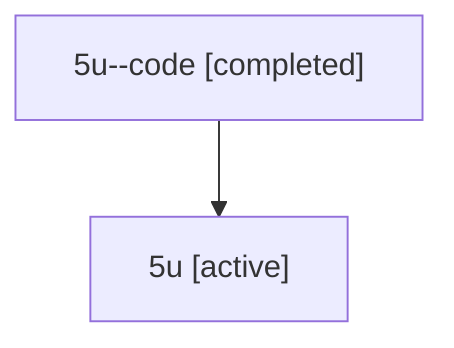

# Family: 5u

[Agent Hoods](../README.md) / [bbugyi200](../users/bbugyi200/README.md) / [athena](../users/bbugyi200/machines/athena/README.md) / [5u](../users/bbugyi200/machines/athena/hoods/5u/README.md) / 5u

Owner: `bbugyi200.athena` · Hood: `5u` · Members: 2

## Lineage

The diagram is an optional enhancement; the ordered table below contains the same lineage in accessible text.

| Role | Agent | State | Model / provider | Timing | Commits | Prompt | Chat |
|---|---|---|---|---|---:|---|---|
| code | 5u--code | completed | gpt-5.6-sol / codex | 2026-07-11T17:02:10.727954+00:00 | [1](../agents/bbugyi200.athena.5u--code/README.md#commits) | — | [Chat](../agents/bbugyi200.athena.5u--code/chat.md) |
| root | 5u | active | gpt-5.6-sol / codex | 2026-07-11T16:56:14.606163+00:00 | 0 | [Prompt](../agents/bbugyi200.athena.5u/prompt.md) | [Chat](../agents/bbugyi200.athena.5u/chat.md) |

## Commits

| Role | Repo | Commit | Subject | Committed |
|---|---|---|---|---|
| — | sase | [`5dd91fd`](https://github.com/sase-org/sase/commit/5dd91fdd43ca920ac5a70974d20ca0bbe7a71c02) | chore: Add SDD prompt and plan for prompt\_vim\_keymaps | 2026-06-12 12:48:58 EDT |
| — | sase | [`9415989`](https://github.com/sase-org/sase/commit/9415989d08385937336e53a32840db4057c1d905) | chore: create prompt vim keymaps epic beads | 2026-06-12 12:58:01 EDT |
| code | sase | [`8af1d23`](https://github.com/sase-org/sase/commit/8af1d23841e8e9e6f3d9a85e4f2fdf228050e7f3) | feat: simplify custom revival search | 2026-07-11 13:14:09 EDT |

## Neighbors

| Agent | Relation | State |
|---|---|---|
| [5u.f-0](bbugyi200.athena.5u.f-0.md) (family · 2) | descendant | active 1, completed 1 |
