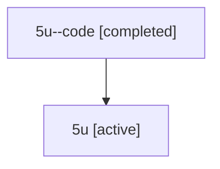

# Family: 5u

Owner: `bbugyi200.athena` · Hood: `5u` · Members: 2

## Lineage

The diagram is an optional enhancement; the ordered table below contains the same lineage in accessible text.

| Role | Agent | State | Model / provider | Timing | Commits | Prompt | Chat |
|---|---|---|---|---|---:|---|---|
| code | 5u--code | completed | gpt-5.6-sol / codex | 2026-07-11T17:02:10.727954+00:00 | 1 | — | [Chat](../agents/bbugyi200.athena.5u--code/chat.md) |
| root | 5u | active | gpt-5.6-sol / codex | 2026-07-11T16:56:14.606163+00:00 | 3 | [Prompt](../agents/bbugyi200.athena.5u/prompt.md) | [Chat](../agents/bbugyi200.athena.5u/chat.md) |
