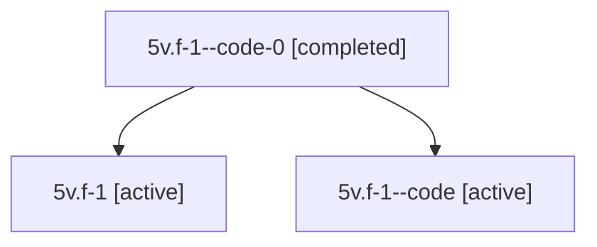

# Family: 5v.f-1

Owner: `bbugyi200.athena` · Hood: `5v` · Members: 3

## Lineage

The diagram is an optional enhancement; the ordered table below contains the same lineage in accessible text.

| Role | Agent | State | Model / provider | Timing | Commits | Prompt | Chat |
|---|---|---|---|---|---:|---|---|
| code-0 | 5v.f-1--code-0 | completed | gpt-5.6-sol / codex | 2026-07-11T20:38:36.982917+00:00 | 0 | — | [Chat](../agents/bbugyi200.athena.5v.f-1--code-0/chat.md) |
| root | 5v.f-1 | active | gpt-5.6-sol / codex | 2026-07-11T20:02:19.607359+00:00 | 1 | [Prompt](../agents/bbugyi200.athena.5v.f-1/prompt.md) | [Chat](../agents/bbugyi200.athena.5v.f-1/chat.md) |
| code | 5v.f-1--code | active | gpt-5.6-sol / codex | 2026-07-11T20:07:36.925950+00:00 | 0 | — | [Chat](../agents/bbugyi200.athena.5v.f-1--code/chat.md) |
