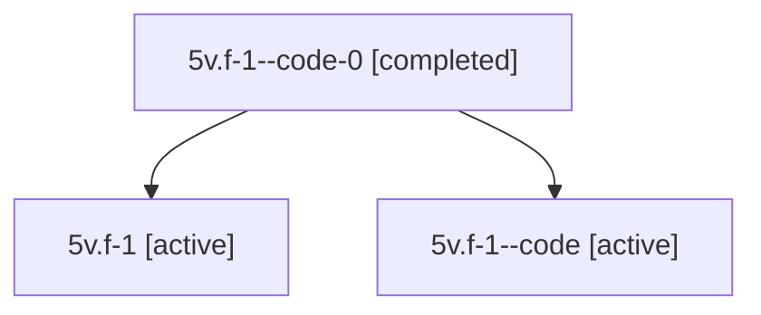

# Family: 5v.f-1

[Agent Hoods](../README.md) / [bbugyi200](../users/bbugyi200/README.md) / [athena](../users/bbugyi200/machines/athena/README.md) / [5v](../users/bbugyi200/machines/athena/hoods/5v/README.md) / 5v.f-1

Owner: `bbugyi200.athena` · Hood: `5v` · Members: 3

## Lineage

The diagram is an optional enhancement; the ordered table below contains the same lineage in accessible text.

| Role | Agent | State | Model / provider | Timing | Commits | Prompt | Chat |
|---|---|---|---|---|---:|---|---|
| code-0 | 5v.f-1--code-0 | completed | gpt-5.6-sol / codex | 2026-07-11T20:38:36.982917+00:00 | 0 | — | [Chat](../agents/bbugyi200.athena.5v.f-1--code-0/chat.md) |
| root | 5v.f-1 | active | gpt-5.6-sol / codex | 2026-07-11T20:02:19.607359+00:00 | [1](../agents/bbugyi200.athena.5v.f-1/README.md#commits) | [Prompt](../agents/bbugyi200.athena.5v.f-1/prompt.md) | [Chat](../agents/bbugyi200.athena.5v.f-1/chat.md) |
| code | 5v.f-1--code | active | gpt-5.6-sol / codex | 2026-07-11T20:07:36.925950+00:00 | 0 | — | [Chat](../agents/bbugyi200.athena.5v.f-1--code/chat.md) |

## Commits

| Role | Repo | Commit | Subject | Committed (UTC) |
|---|---|---|---|---|
| root | sase | [`546a115`](https://github.com/sase-org/sase/commit/546a1155f210569ae093e3dc0ffa3bd05f36e47f) | feat(sdd)!: retire legacy plan layout | 2026-07-11 20:35:05 |

## Neighbors

| Agent | Relation | State |
|---|---|---|
| [5v](bbugyi200.athena.5v.md) (family · 2) | ancestor | active 1, completed 1 |
| [5v.f-0](../agents/bbugyi200.athena.5v.f-0/README.md) | 5v hood | active |
