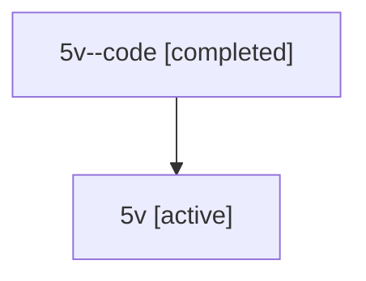

# Family: 5v

[Agent Hoods](../README.md) / [bbugyi200](../users/bbugyi200/README.md) / [athena](../users/bbugyi200/machines/athena/README.md) / [5v](../users/bbugyi200/machines/athena/hoods/5v/README.md) / 5v

Owner: `bbugyi200.athena` · Hood: `5v` · Members: 2

## Lineage

The diagram is an optional enhancement; the ordered table below contains the same lineage in accessible text.

| Role | Agent | State | Model / provider | Timing | Commits | Prompt | Chat |
|---|---|---|---|---|---:|---|---|
| code | 5v--code | completed | gpt-5.6-sol / codex | 2026-07-11T17:39:18.589875+00:00 | 0 | — | [Chat](../agents/bbugyi200.athena.5v--code/chat.md) |
| root | 5v | active | claude-fable-5 / claude | 2026-07-11T17:26:48.740585+00:00 | [3](../agents/bbugyi200.athena.5v/README.md#commits) | [Prompt](../agents/bbugyi200.athena.5v/prompt.md) | [Chat](../agents/bbugyi200.athena.5v/chat.md) |

## Commits

| Role | Repo | Commit | Subject | Committed |
|---|---|---|---|---|
| root | sase | [`7f7b213`](https://github.com/sase-org/sase/commit/7f7b213adfacb4d51973abfd99d4a76bb46c3529) | chore: Add SDD prompt and plan for pypi\_smoke\_env | 2026-06-12 12:52:37 EDT |
| root | sase | [`d5af376`](https://github.com/sase-org/sase/commit/d5af3768ac2935116a40c22ced7579e60a67ed1e) | build: add PyPI release smoke harness | 2026-06-12 13:09:33 EDT |
| root | sase | [`b3c7582`](https://github.com/sase-org/sase/commit/b3c75827571fde1b6027e3f7d2f0bac40d3d9530) | feat(sdd): unify tale and epic plan storage | 2026-07-11 14:14:26 EDT |

## Neighbors

| Agent | Relation | State |
|---|---|---|
| [5v.f-0](../agents/bbugyi200.athena.5v.f-0/README.md) | descendant | active |
| [5v.f-1](bbugyi200.athena.5v.f-1.md) (family · 3) | descendant | active 2, completed 1 |
