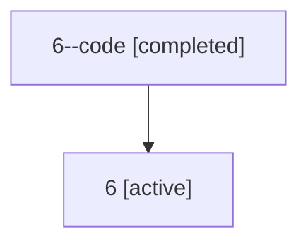

# Family: 6

Owner: `bbugyi200.athena` · Hood: `6` · Members: 2

## Lineage

The diagram is an optional enhancement; the ordered table below contains the same lineage in accessible text.

| Role | Agent | State | Model / provider | Timing | Commits | Prompt | Chat |
|---|---|---|---|---|---:|---|---|
| code | 6--code | completed | gpt-5.5 / codex | 2026-07-06T15:46:02.690539+00:00 | 0 | — | [Chat](../agents/bbugyi200.athena.6--code/chat.md) |
| root | 6 | active | claude-fable-5 / claude | 2026-07-06T15:40:09.858168+00:00 | 2 | [Prompt](../agents/bbugyi200.athena.6/prompt.md) | [Chat](../agents/bbugyi200.athena.6/chat.md) |
