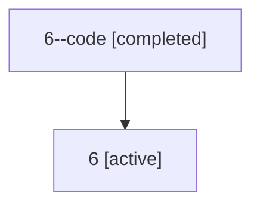

# Family: 6

[Agent Hoods](../README.md) / [bbugyi200](../users/bbugyi200/README.md) / [athena](../users/bbugyi200/machines/athena/README.md) / [6](../users/bbugyi200/machines/athena/hoods/6/README.md) / 6

Owner: `bbugyi200.athena` · Hood: `6` · Members: 2

## Lineage

The diagram is an optional enhancement; the ordered table below contains the same lineage in accessible text.

| Role | Agent | State | Model / provider | Timing | Commits | Prompt | Chat |
|---|---|---|---|---|---:|---|---|
| code | 6--code | completed | gpt-5.5 / codex | 2026-07-06T15:46:02.690539+00:00 | 0 | — | [Chat](../agents/bbugyi200.athena.6--code/chat.md) |
| root | 6 | active | claude-fable-5 / claude | 2026-07-06T15:40:09.858168+00:00 | [2](../agents/bbugyi200.athena.6/README.md#commits) | [Prompt](../agents/bbugyi200.athena.6/prompt.md) | [Chat](../agents/bbugyi200.athena.6/chat.md) |

## Commits

| Role | Repo | Commit | Subject | Committed (UTC) |
|---|---|---|---|---|
| root | sase | [`ba445aa`](https://github.com/sase-org/sase/commit/ba445aaf98c45d1091f82d36819390d84342a479) | chore: Add SDD prompt and plan for bare\_git\_first\_use\_init | 2026-07-06 15:46:01 |
| root | sase | [`dff269e`](https://github.com/sase-org/sase/commit/dff269e3a8642a84609ae17d7b3c4ba91595f577) | fix: recover bare git projects from partial init state | 2026-07-06 15:58:13 |
