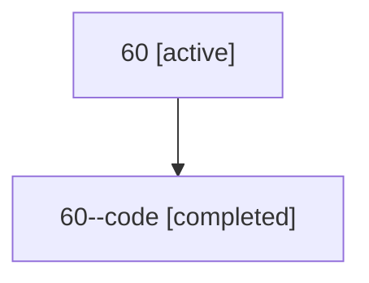

# Family: 60

[Agent Hoods](../README.md) / [bbugyi200](../users/bbugyi200/README.md) / [athena](../users/bbugyi200/machines/athena/README.md) / [60](../users/bbugyi200/machines/athena/hoods/60/README.md) / 60

Owner: `bbugyi200.athena` · Hood: `60` · Members: 2

## Lineage

The diagram is an optional enhancement; the ordered table below contains the same lineage in accessible text.

| Role | Agent | State | Model / provider | Timing | Commits | Prompt | Chat |
|---|---|---|---|---|---:|---|---|
| root | 60 | active | gpt-5.6-sol / codex | 2026-07-11T18:28:01.723898+00:00 | [1](../agents/bbugyi200.athena.60/README.md#commits) | [Prompt](../agents/bbugyi200.athena.60/prompt.md) | [Chat](../agents/bbugyi200.athena.60/chat.md) |
| code | 60--code | completed | gpt-5.6-sol / codex | 2026-07-11T18:31:07.363678+00:00 | 0 | — | [Chat](../agents/bbugyi200.athena.60--code/chat.md) |

## Commits

| Role | Commit | Subject | Committed (UTC) |
|---|---|---|---|
| root | [`73b7db3`](https://github.com/sase-org/sase/commit/73b7db3afbd1c9951be5703247624ee58427728f) | fix: hide audit launcher marker notifications | 2026-07-11 18:39:15 |
