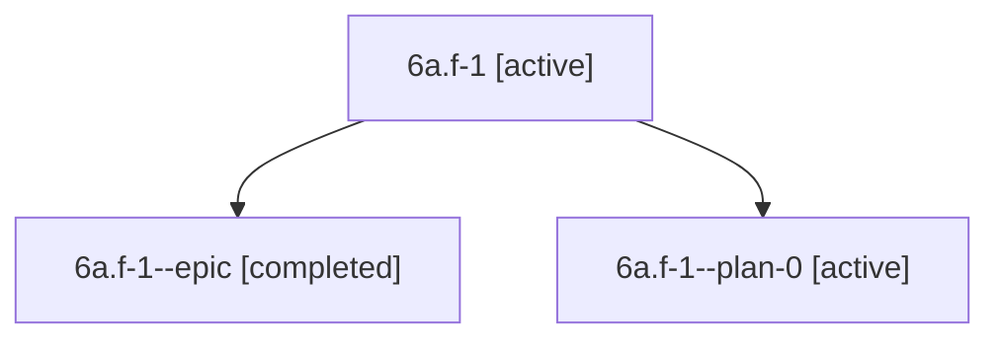

# Family: 6a.f-1

[Agent Hoods](../README.md) / [bbugyi200](../users/bbugyi200/README.md) / [athena](../users/bbugyi200/machines/athena/README.md) / [6a](../users/bbugyi200/machines/athena/hoods/6a/README.md) / 6a.f-1

Owner: `bbugyi200.athena` · Hood: `6a` · Members: 3

## Lineage

The diagram is an optional enhancement; the ordered table below contains the same lineage in accessible text.

| Role | Agent | State | Model / provider | Timing | Commits | Prompt | Chat |
|---|---|---|---|---|---:|---|---|
| root | 6a.f-1 | active | claude-fable-5 / claude | 2026-07-11T22:16:28.897883+00:00 | 0 | [Prompt](../agents/bbugyi200.athena.6a.f-1/prompt.md) | [Chat](../agents/bbugyi200.athena.6a.f-1/chat.md) |
| epic | 6a.f-1--epic | completed | gpt-5.6-sol / codex | 2026-07-11T23:07:14.313575+00:00 | 0 | — | [Chat](../agents/bbugyi200.athena.6a.f-1--epic/chat.md) |
| plan-0 | 6a.f-1--plan-0 | active | claude-fable-5 / claude | 2026-07-11T22:50:15.172059+00:00 | 0 | — | [Chat](../agents/bbugyi200.athena.6a.f-1--plan-0/chat.md) |

## Neighbors

| Agent | Relation | State |
|---|---|---|
| [6a](bbugyi200.athena.6a.md) (family · 2) | ancestor | active 1, completed 1 |
| [6a.f-0](../agents/bbugyi200.athena.6a.f-0/README.md) | 6a hood | waiting |
