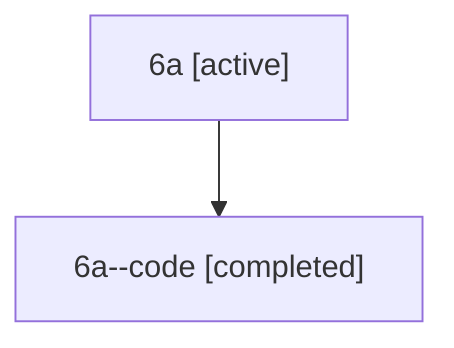

# Family: 6a

[Agent Hoods](../README.md) / [bbugyi200](../users/bbugyi200/README.md) / [athena](../users/bbugyi200/machines/athena/README.md) / [6a](../users/bbugyi200/machines/athena/hoods/6a/README.md) / 6a

Owner: `bbugyi200.athena` · Hood: `6a` · Members: 2

## Lineage

The diagram is an optional enhancement; the ordered table below contains the same lineage in accessible text.

| Role | Agent | State | Model / provider | Timing | Commits | Prompt | Chat |
|---|---|---|---|---|---:|---|---|
| root | 6a | active | claude-fable-5 / claude | 2026-07-11T21:41:55.735755+00:00 | [1](../agents/bbugyi200.athena.6a/README.md#commits) | [Prompt](../agents/bbugyi200.athena.6a/prompt.md) | [Chat](../agents/bbugyi200.athena.6a/chat.md) |
| code | 6a--code | completed | gpt-5.6-sol / codex | 2026-07-11T21:49:43.628425+00:00 | 0 | — | [Chat](../agents/bbugyi200.athena.6a--code/chat.md) |

## Commits

| Role | Repo | Commit | Subject | Committed (UTC) |
|---|---|---|---|---|
| root | sase | [`953f070`](https://github.com/sase-org/sase/commit/953f0704710b7c51e8dbf4f0a17cd95e648fdff7) | feat(workspace): relocate linked repository clones | 2026-07-11 22:14:55 |

## Neighbors

| Agent | Relation | State |
|---|---|---|
| [6a.f-0](../agents/bbugyi200.athena.6a.f-0/README.md) | descendant | waiting |
| [6a.f-1](bbugyi200.athena.6a.f-1.md) (family · 3) | descendant | active 2, completed 1 |
