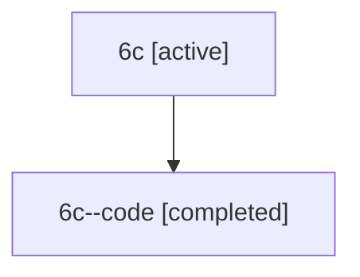

# Family: 6c

[Agent Hoods](../README.md) / [bbugyi200](../users/bbugyi200/README.md) / [athena](../users/bbugyi200/machines/athena/README.md) / [6c](../users/bbugyi200/machines/athena/hoods/6c/README.md) / 6c

Owner: `bbugyi200.athena` · Hood: `6c` · Members: 2

## Lineage

The diagram is an optional enhancement; the ordered table below contains the same lineage in accessible text.

| Role | Agent | State | Model / provider | Timing | Commits | Prompt | Chat |
|---|---|---|---|---|---:|---|---|
| root | 6c | active | claude-fable-5 / claude | 2026-07-11T23:05:44.726802+00:00 | [3](../agents/bbugyi200.athena.6c/README.md#commits) | [Prompt](../agents/bbugyi200.athena.6c/prompt.md) | [Chat](../agents/bbugyi200.athena.6c/chat.md) |
| code | 6c--code | completed | gpt-5.6-sol / codex | 2026-07-11T23:16:10.138144+00:00 | [1](../agents/bbugyi200.athena.6c--code/README.md#commits) | — | [Chat](../agents/bbugyi200.athena.6c--code/chat.md) |

## Commits

| Role | Commit | Subject | Committed (UTC) |
|---|---|---|---|
| root | [`d676110`](https://github.com/sase-org/sase/commit/d676110cdba180b0d2dfb19d0ed20e21ccbebc92) | chore: Add SDD prompt and plan for plan\_command\_subcommands | 2026-06-13 13:55:50 |
| root | [`826dd7e`](https://github.com/sase-org/sase/commit/826dd7ecb4b5dcbbcc38dc4e3320ffaade552a47) | chore: create plan command subcommand epic beads | 2026-06-13 14:03:59 |
| code | [`08b2f73`](https://github.com/sase-org/sase/commit/08b2f73ed69df95437787a046ab9465af7a88455) | fix: preserve display-prefixed ChangeSpec refs | 2026-07-11 23:24:12 |
| root | [`08b2f73`](https://github.com/sase-org/sase/commit/08b2f73ed69df95437787a046ab9465af7a88455) | fix: preserve display-prefixed ChangeSpec refs | 2026-07-11 23:24:12 |
