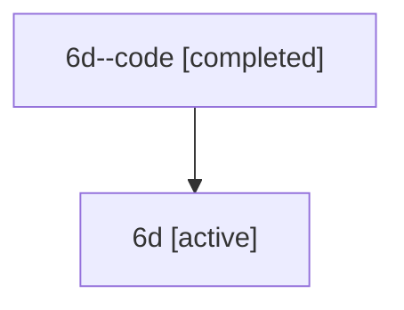

# Family: 6d

[Agent Hoods](../README.md) / [bbugyi200](../users/bbugyi200/README.md) / [athena](../users/bbugyi200/machines/athena/README.md) / [6d](../users/bbugyi200/machines/athena/hoods/6d/README.md) / 6d

Owner: `bbugyi200.athena` · Hood: `6d` · Members: 2

## Lineage

The diagram is an optional enhancement; the ordered table below contains the same lineage in accessible text.

| Role | Agent | State | Model / provider | Timing | Commits | Prompt | Chat |
|---|---|---|---|---|---:|---|---|
| code | 6d--code | completed | gpt-5.6-sol / codex | 2026-07-11T23:50:30.500305+00:00 | [1](../agents/bbugyi200.athena.6d--code/README.md#commits) | — | [Chat](../agents/bbugyi200.athena.6d--code/chat.md) |
| root | 6d | active | claude-fable-5 / claude | 2026-07-11T23:37:58.764627+00:00 | 0 | [Prompt](../agents/bbugyi200.athena.6d/prompt.md) | [Chat](../agents/bbugyi200.athena.6d/chat.md) |

## Commits

| Role | Repo | Commit | Subject | Committed |
|---|---|---|---|---|
| code | sase | [`ddd0b63`](https://github.com/sase-org/sase/commit/ddd0b63f22dce1e5e5d2c8d35af96b9fd2967a3f) | feat: support launch-scoped model alias overrides | 2026-07-11 20:11:16 EDT |
