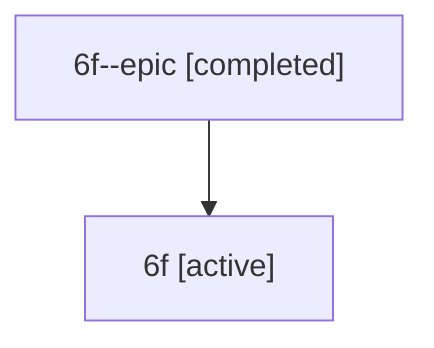

# Family: 6f

[Agent Hoods](../README.md) / [bbugyi200](../users/bbugyi200/README.md) / [athena](../users/bbugyi200/machines/athena/README.md) / [6f](../users/bbugyi200/machines/athena/hoods/6f/README.md) / 6f

Owner: `bbugyi200.athena` · Hood: `6f` · Members: 2

## Lineage

The diagram is an optional enhancement; the ordered table below contains the same lineage in accessible text.

| Role | Agent | State | Model / provider | Timing | Commits | Prompt | Chat |
|---|---|---|---|---|---:|---|---|
| epic | 6f--epic | completed | gpt-5.6-sol / codex | 2026-07-11T23:59:31.639868+00:00 | 0 | — | [Chat](../agents/bbugyi200.athena.6f--epic/chat.md) |
| root | 6f | active | claude-fable-5 / claude | 2026-07-11T23:49:20.469176+00:00 | 0 | [Prompt](../agents/bbugyi200.athena.6f/prompt.md) | [Chat](../agents/bbugyi200.athena.6f/chat.md) |

## Neighbors

| Agent | Relation | State |
|---|---|---|
| [6f.cld](../agents/bbugyi200.athena.6f.cld/README.md) | descendant | completed |
| [6f.cld.f1.cdx](../agents/bbugyi200.athena.6f.cld.f1.cdx/README.md) | descendant | completed |
| [6f.cld.f1.cdx.f1](../agents/bbugyi200.athena.6f.cld.f1.cdx.f1/README.md) | descendant | completed |
| [6f.f-0](../agents/bbugyi200.athena.6f.f-0/README.md) | descendant | waiting |
| [6f.f-1](../agents/bbugyi200.athena.6f.f-1/README.md) | descendant | active |
