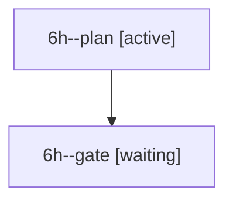

# Family: 6h

[Agent Hoods](../README.md) / [bbugyi200](../users/bbugyi200/README.md) / [athena](../users/bbugyi200/machines/athena/README.md) / [6h](../users/bbugyi200/machines/athena/hoods/6h/README.md) / 6h

Owner: `bbugyi200.athena` · Hood: `6h` · Members: 2

## Lineage

The diagram is an optional enhancement; the ordered table below contains the same lineage in accessible text.

| Role | Agent | State | Model / provider | Timing | Commits | Prompt | Chat |
|---|---|---|---|---|---:|---|---|
| plan | 6h--plan | active | claude-fable-5 / claude | 2026-09-13T19:42:06.702121+00:00 | 0 | [Prompt](../agents/bbugyi200.athena.6h--plan/prompt.md) | [Chat](../agents/bbugyi200.athena.6h--plan/chat.md) |
| gate | 6h--gate | waiting | claude-fable-5 / claude | 2026-09-13T19:54:16.434143+00:00 → 2026-09-14T20:30:14.515467+00:00 | 0 | — | [Chat](../agents/bbugyi200.athena.6h--gate/chat.md) |

## Neighbors

| Agent | Relation | State |
|---|---|---|
| [6h.cld](../agents/bbugyi200.athena.6h.cld/README.md) | descendant | completed |
