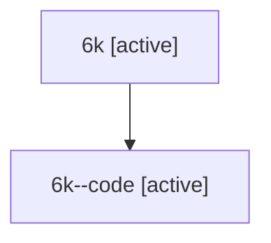

# Family: 6k

[Agent Hoods](../README.md) / [bbugyi200](../users/bbugyi200/README.md) / [athena](../users/bbugyi200/machines/athena/README.md) / [6k](../users/bbugyi200/machines/athena/hoods/6k/README.md) / 6k

Owner: `bbugyi200.athena` · Hood: `6k` · Members: 2

## Lineage

The diagram is an optional enhancement; the ordered table below contains the same lineage in accessible text.

| Role | Agent | State | Model / provider | Timing | Commits | Prompt | Chat |
|---|---|---|---|---|---:|---|---|
| root | 6k | active | claude-fable-5 / claude | 2026-07-12T12:53:21.012012+00:00 | 0 | [Prompt](../agents/bbugyi200.athena.6k/prompt.md) | [Chat](../agents/bbugyi200.athena.6k/chat.md) |
| code | 6k--code | active | gpt-5.6-sol / codex | 2026-07-12T13:02:52.193934+00:00 | [1](../agents/bbugyi200.athena.6k--code/README.md#commits) | — | — |

## Commits

| Role | Repo | Commit | Subject | Committed |
|---|---|---|---|---|
| code | sase | [`6ab1482`](https://github.com/sase-org/sase/commit/6ab1482bb99eeb9d03a008a82ef5456a4dd596d8) | feat(tui): add prompt stash preview panes | 2026-07-12 09:26:49 EDT |

## Neighbors

| Agent | Relation | State |
|---|---|---|
| [6k.f-0](../agents/bbugyi200.athena.6k.f-0/README.md) | descendant | active |
