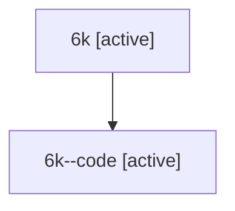

# Family: 6k

Owner: `bbugyi200.athena` · Hood: `6k` · Members: 2

## Lineage

The diagram is an optional enhancement; the ordered table below contains the same lineage in accessible text.

| Role | Agent | State | Model / provider | Timing | Commits | Prompt | Chat |
|---|---|---|---|---|---:|---|---|
| root | 6k | active | claude-fable-5 / claude | 2026-07-12T12:53:21.012012+00:00 | 1 | [Prompt](../agents/bbugyi200.athena.6k/prompt.md) | [Chat](../agents/bbugyi200.athena.6k/chat.md) |
| code | 6k--code | active | gpt-5.6-sol / codex | 2026-07-12T13:02:52.193934+00:00 | 0 | — | — |
