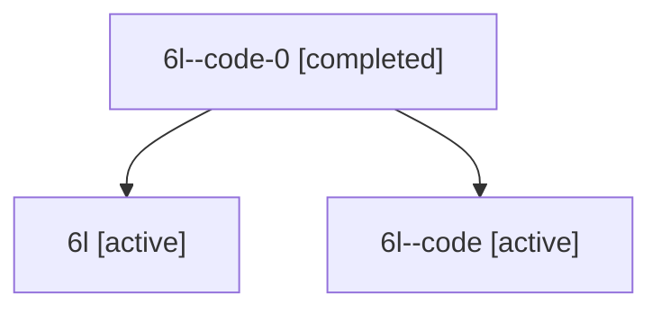

# Family: 6l

Owner: `bbugyi200.athena` · Hood: `6l` · Members: 3

## Lineage

The diagram is an optional enhancement; the ordered table below contains the same lineage in accessible text.

| Role | Agent | State | Model / provider | Timing | Commits | Prompt | Chat |
|---|---|---|---|---|---:|---|---|
| code-0 | 6l--code-0 | completed | gpt-5.6-sol / codex | 2026-07-12T13:33:38.577702+00:00 | 0 | — | [Chat](../agents/bbugyi200.athena.6l--code-0/chat.md) |
| root | 6l | active | claude-fable-5 / claude | 2026-07-12T12:57:51.312901+00:00 | 1 | [Prompt](../agents/bbugyi200.athena.6l/prompt.md) | [Chat](../agents/bbugyi200.athena.6l/chat.md) |
| code | 6l--code | active | gpt-5.6-sol / codex | 2026-07-12T13:11:16.496635+00:00 | 0 | — | [Chat](../agents/bbugyi200.athena.6l--code/chat.md) |
