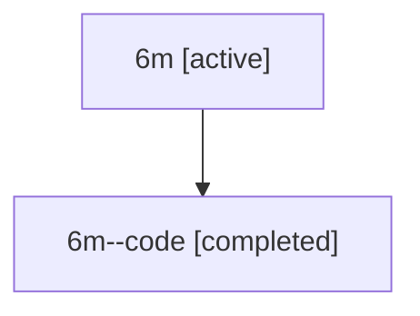

# Family: 6m

[Agent Hoods](../README.md) / [bbugyi200](../users/bbugyi200/README.md) / [athena](../users/bbugyi200/machines/athena/README.md) / [6m](../users/bbugyi200/machines/athena/hoods/6m/README.md) / 6m

Owner: `bbugyi200.athena` · Hood: `6m` · Members: 2

## Lineage

The diagram is an optional enhancement; the ordered table below contains the same lineage in accessible text.

| Role | Agent | State | Model / provider | Timing | Commits | Prompt | Chat |
|---|---|---|---|---|---:|---|---|
| root | 6m | active | gpt-5.6-sol / codex | 2026-07-12T13:24:51.399322+00:00 | [3](../agents/bbugyi200.athena.6m/README.md#commits) | [Prompt](../agents/bbugyi200.athena.6m/prompt.md) | [Chat](../agents/bbugyi200.athena.6m/chat.md) |
| code | 6m--code | completed | gpt-5.6-sol / codex | 2026-07-12T13:36:11.534412+00:00 | [1](../agents/bbugyi200.athena.6m--code/README.md#commits) | — | [Chat](../agents/bbugyi200.athena.6m--code/chat.md) |

## Commits

| Role | Repo | Commit | Subject | Committed |
|---|---|---|---|---|
| root | sase | [`86af3a8`](https://github.com/sase-org/sase/commit/86af3a8713abe0c9bbec65a3f4350c0296c580eb) | chore: Add SDD prompt and plan for plan\_list\_live\_agents | 2026-06-13 12:13:19 EDT |
| root | sase | [`f15d55c`](https://github.com/sase-org/sase/commit/f15d55c7efb914a3dc795a4e3867c1b279ca4bef) | fix(plan): filter pending approvals to live agents | 2026-06-13 12:29:37 EDT |
| code | sase | [`e2274e5`](https://github.com/sase-org/sase/commit/e2274e52b3b8cb6897eb0c8fe22eb32ae5c97064) | fix: preserve primary commit diff provenance | 2026-07-12 09:59:38 EDT |
| root | sase | [`e2274e5`](https://github.com/sase-org/sase/commit/e2274e52b3b8cb6897eb0c8fe22eb32ae5c97064) | fix: preserve primary commit diff provenance | 2026-07-12 09:59:38 EDT |
