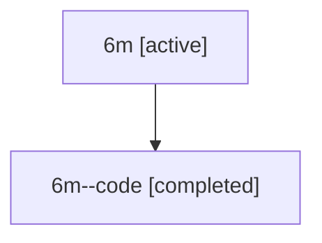

# Family: 6m

Owner: `bbugyi200.athena` · Hood: `6m` · Members: 2

## Lineage

The diagram is an optional enhancement; the ordered table below contains the same lineage in accessible text.

| Role | Agent | State | Model / provider | Timing | Commits | Prompt | Chat |
|---|---|---|---|---|---:|---|---|
| root | 6m | active | gpt-5.6-sol / codex | 2026-07-12T13:24:51.399322+00:00 | 3 | [Prompt](../agents/bbugyi200.athena.6m/prompt.md) | [Chat](../agents/bbugyi200.athena.6m/chat.md) |
| code | 6m--code | completed | gpt-5.6-sol / codex | 2026-07-12T13:36:11.534412+00:00 | 1 | — | [Chat](../agents/bbugyi200.athena.6m--code/chat.md) |
