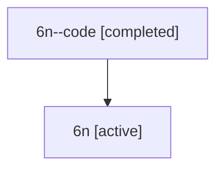

# Family: 6n

[Agent Hoods](../README.md) / [bbugyi200](../users/bbugyi200/README.md) / [athena](../users/bbugyi200/machines/athena/README.md) / [6n](../users/bbugyi200/machines/athena/hoods/6n/README.md) / 6n

Owner: `bbugyi200.athena` · Hood: `6n` · Members: 2

## Lineage

The diagram is an optional enhancement; the ordered table below contains the same lineage in accessible text.

| Role | Agent | State | Model / provider | Timing | Commits | Prompt | Chat |
|---|---|---|---|---|---:|---|---|
| code | 6n--code | completed | gpt-5.6-sol / codex | 2026-07-12T13:54:27.258463+00:00 | 0 | — | [Chat](../agents/bbugyi200.athena.6n--code/chat.md) |
| root | 6n | active | claude-fable-5 / claude | 2026-07-12T13:27:36.848941+00:00 | [3](../agents/bbugyi200.athena.6n/README.md#commits) | [Prompt](../agents/bbugyi200.athena.6n/prompt.md) | [Chat](../agents/bbugyi200.athena.6n/chat.md) |

## Commits

| Role | Commit | Subject | Committed (UTC) |
|---|---|---|---|
| root | [`38d8c73`](https://github.com/sase-org/sase/commit/38d8c7364c2e4e775931c372320123ef0e64e00c) | chore: Add SDD prompt and plan for worker\_models\_mapping | 2026-06-13 16:50:03 |
| root | [`51a36b8`](https://github.com/sase-org/sase/commit/51a36b83d0caea4147e99a86fe99335c3f06ee58) | feat!: map worker models by primary lane | 2026-06-13 17:07:39 |
| root | [`b788ca5`](https://github.com/sase-org/sase/commit/b788ca52264df2652e7b29063c5d3a67448ee75f) | fix(tui): prevent message pump starvation | 2026-07-12 14:31:55 |
