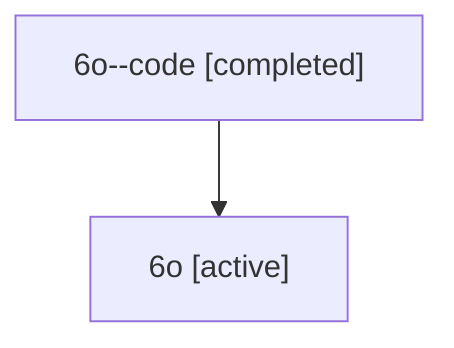

# Family: 6o

[Agent Hoods](../README.md) / [bbugyi200](../users/bbugyi200/README.md) / [athena](../users/bbugyi200/machines/athena/README.md) / [6o](../users/bbugyi200/machines/athena/hoods/6o/README.md) / 6o

Owner: `bbugyi200.athena` · Hood: `6o` · Members: 2

## Lineage

The diagram is an optional enhancement; the ordered table below contains the same lineage in accessible text.

| Role | Agent | State | Model / provider | Timing | Commits | Prompt | Chat |
|---|---|---|---|---|---:|---|---|
| code | 6o--code | completed | gpt-5.6-sol / codex | 2026-07-12T13:41:07.675156+00:00 | 0 | — | [Chat](../agents/bbugyi200.athena.6o--code/chat.md) |
| root | 6o | active | gpt-5.6-sol / codex | 2026-07-12T13:36:40.342654+00:00 | [1](../agents/bbugyi200.athena.6o/README.md#commits) | [Prompt](../agents/bbugyi200.athena.6o/prompt.md) | [Chat](../agents/bbugyi200.athena.6o/chat.md) |

## Commits

| Role | Repo | Commit | Subject | Committed (UTC) |
|---|---|---|---|---|
| root | sase | [`fd0a3c5`](https://github.com/sase-org/sase/commit/fd0a3c53c3c8aa4aae17313ad63c577e5a4ed5f0) | feat(tui): add prompt stash leader shortcut | 2026-07-12 13:53:29 |
