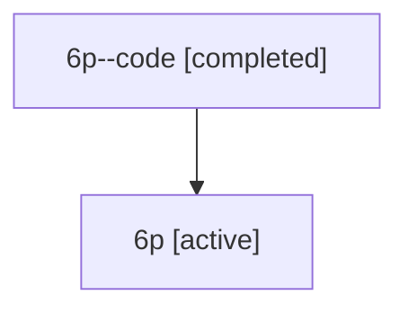

# Family: 6p

Owner: `bbugyi200.athena` · Hood: `6p` · Members: 2

## Lineage

The diagram is an optional enhancement; the ordered table below contains the same lineage in accessible text.

| Role | Agent | State | Model / provider | Timing | Commits | Prompt | Chat |
|---|---|---|---|---|---:|---|---|
| code | 6p--code | completed | gpt-5.6-sol / codex | 2026-07-12T14:42:35.697766+00:00 | 0 | — | [Chat](../agents/bbugyi200.athena.6p--code/chat.md) |
| root | 6p | active | claude-fable-5 / claude | 2026-07-12T14:17:42.769073+00:00 | 3 | [Prompt](../agents/bbugyi200.athena.6p/prompt.md) | [Chat](../agents/bbugyi200.athena.6p/chat.md) |
