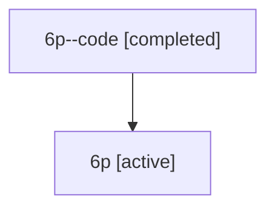

# Family: 6p

[Agent Hoods](../README.md) / [bbugyi200](../users/bbugyi200/README.md) / [athena](../users/bbugyi200/machines/athena/README.md) / [6p](../users/bbugyi200/machines/athena/hoods/6p/README.md) / 6p

Owner: `bbugyi200.athena` · Hood: `6p` · Members: 2

## Lineage

The diagram is an optional enhancement; the ordered table below contains the same lineage in accessible text.

| Role | Agent | State | Model / provider | Timing | Commits | Prompt | Chat |
|---|---|---|---|---|---:|---|---|
| code | 6p--code | completed | gpt-5.6-sol / codex | 2026-07-12T14:42:35.697766+00:00 | 0 | — | [Chat](../agents/bbugyi200.athena.6p--code/chat.md) |
| root | 6p | active | claude-fable-5 / claude | 2026-07-12T14:17:42.769073+00:00 | [3](../agents/bbugyi200.athena.6p/README.md#commits) | [Prompt](../agents/bbugyi200.athena.6p/prompt.md) | [Chat](../agents/bbugyi200.athena.6p/chat.md) |

## Commits

| Role | Repo | Commit | Subject | Committed (UTC) |
|---|---|---|---|---|
| root | sase | [`59b6b0f`](https://github.com/sase-org/sase/commit/59b6b0faec49eaa7356b2ccf073f1255d0db09f3) | chore: Add SDD prompt and plan for prompt\_history\_metadata | 2026-06-13 17:01:45 |
| root | sase | [`bdea1b3`](https://github.com/sase-org/sase/commit/bdea1b3f805fde1dfa2a9851159d18f00e97681e) | feat(tui): surface prompt metadata in history modal | 2026-06-13 17:18:35 |
| root | sase | [`6df95bb`](https://github.com/sase-org/sase/commit/6df95bbecc640071a22a768af6c5718242227d1d) | fix(sdd): preserve unknown store records | 2026-07-12 15:08:13 |

## Neighbors

| Agent | Relation | State |
|---|---|---|
| [6p.f1](../agents/bbugyi200.athena.6p.f1/README.md) | descendant | completed |
