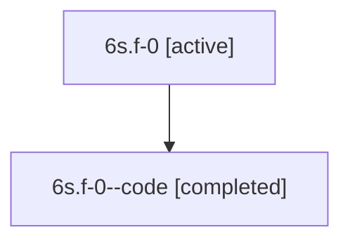

# Family: 6s.f-0

[Agent Hoods](../README.md) / [bbugyi200](../users/bbugyi200/README.md) / [athena](../users/bbugyi200/machines/athena/README.md) / [6s](../users/bbugyi200/machines/athena/hoods/6s/README.md) / 6s.f-0

Owner: `bbugyi200.athena` · Hood: `6s` · Members: 2

## Lineage

The diagram is an optional enhancement; the ordered table below contains the same lineage in accessible text.

| Role | Agent | State | Model / provider | Timing | Commits | Prompt | Chat |
|---|---|---|---|---|---:|---|---|
| root | 6s.f-0 | active | claude-fable-5 / claude | 2026-07-12T16:12:05.309925+00:00 | 0 | [Prompt](../agents/bbugyi200.athena.6s.f-0/prompt.md) | [Chat](../agents/bbugyi200.athena.6s.f-0/chat.md) |
| code | 6s.f-0--code | completed | gpt-5.6-sol / codex | 2026-07-12T16:23:41.332366+00:00 | [1](../agents/bbugyi200.athena.6s.f-0--code/README.md#commits) | — | [Chat](../agents/bbugyi200.athena.6s.f-0--code/chat.md) |

## Commits

| Role | Repo | Commit | Subject | Committed |
|---|---|---|---|---|
| code | sase | [`e1c2fd0`](https://github.com/sase-org/sase/commit/e1c2fd0c40b97f836799698a496776bc43b40e9d) | feat!: use fixed companion clone directory names | 2026-07-12 16:59:59 UTC |

## Neighbors

| Agent | Relation | State |
|---|---|---|
| [6s](bbugyi200.athena.6s.md) (family · 2) | ancestor | active 1, completed 1 |
