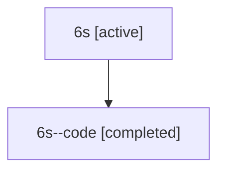

# Family: 6s

Owner: `bbugyi200.athena` · Hood: `6s` · Members: 2

## Lineage

The diagram is an optional enhancement; the ordered table below contains the same lineage in accessible text.

| Role | Agent | State | Model / provider | Timing | Commits | Prompt | Chat |
|---|---|---|---|---|---:|---|---|
| root | 6s | active | claude-fable-5 / claude | 2026-07-12T15:35:44.854456+00:00 | 3 | [Prompt](../agents/bbugyi200.athena.6s/prompt.md) | [Chat](../agents/bbugyi200.athena.6s/chat.md) |
| code | 6s--code | completed | gpt-5.6-sol / codex | 2026-07-12T15:47:53.222506+00:00 | 0 | — | [Chat](../agents/bbugyi200.athena.6s--code/chat.md) |
