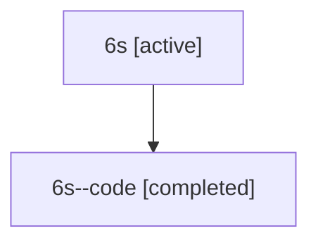

# Family: 6s

[Agent Hoods](../README.md) / [bbugyi200](../users/bbugyi200/README.md) / [athena](../users/bbugyi200/machines/athena/README.md) / [6s](../users/bbugyi200/machines/athena/hoods/6s/README.md) / 6s

Owner: `bbugyi200.athena` · Hood: `6s` · Members: 2

## Lineage

The diagram is an optional enhancement; the ordered table below contains the same lineage in accessible text.

| Role | Agent | State | Model / provider | Timing | Commits | Prompt | Chat |
|---|---|---|---|---|---:|---|---|
| root | 6s | active | claude-fable-5 / claude | 2026-07-12T15:35:44.854456+00:00 | 0 | [Prompt](../agents/bbugyi200.athena.6s/prompt.md) | [Chat](../agents/bbugyi200.athena.6s/chat.md) |
| code | 6s--code | completed | gpt-5.6-sol / codex | 2026-07-12T15:47:53.222506+00:00 | [1](../agents/bbugyi200.athena.6s--code/README.md#commits) | — | [Chat](../agents/bbugyi200.athena.6s--code/chat.md) |

## Commits

| Role | Repo | Commit | Subject | Committed |
|---|---|---|---|---|
| — | sase | [`737954d`](https://github.com/sase-org/sase/commit/737954d2562ee426b0bc3b6c58cd4ceae7439b73) | chore: Add SDD prompt and plan for plan\_list\_perf | 2026-06-13 14:07:04 EDT |
| — | sase | [`cfbad85`](https://github.com/sase-org/sase/commit/cfbad8509c0b263a83f8154d669d8c7d10ea5a4e) | perf: speed up plan list inventory | 2026-06-13 14:31:49 EDT |
| code | sase | [`df60999`](https://github.com/sase-org/sase/commit/df60999b5b38ef1c94dcb247b66a52e744d6e4ad) | feat!: isolate linked repository clones from companions | 2026-07-12 12:11:41 EDT |

## Neighbors

| Agent | Relation | State |
|---|---|---|
| [6s.f-0](bbugyi200.athena.6s.f-0.md) (family · 2) | descendant | active 1, completed 1 |
