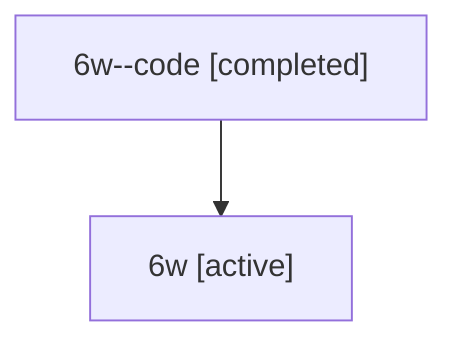

# Family: 6w

[Agent Hoods](../README.md) / [bbugyi200](../users/bbugyi200/README.md) / [athena](../users/bbugyi200/machines/athena/README.md) / [6w](../users/bbugyi200/machines/athena/hoods/6w/README.md) / 6w

Owner: `bbugyi200.athena` · Hood: `6w` · Members: 2

## Lineage

The diagram is an optional enhancement; the ordered table below contains the same lineage in accessible text.

| Role | Agent | State | Model / provider | Timing | Commits | Prompt | Chat |
|---|---|---|---|---|---:|---|---|
| code | 6w--code | completed | gpt-5.6-sol / codex | 2026-07-12T16:43:39.642315+00:00 | 0 | — | [Chat](../agents/bbugyi200.athena.6w--code/chat.md) |
| root | 6w | active | claude-fable-5 / claude | 2026-07-12T16:34:30.190143+00:00 | [3](../agents/bbugyi200.athena.6w/README.md#commits) | [Prompt](../agents/bbugyi200.athena.6w/prompt.md) | [Chat](../agents/bbugyi200.athena.6w/chat.md) |

## Commits

| Role | Repo | Commit | Subject | Committed (UTC) |
|---|---|---|---|---|
| root | sase | [`a7b86be`](https://github.com/sase-org/sase/commit/a7b86be68ee1dc4d9ee8804ee0c32bf928f8e387) | chore: Add SDD prompt and plan for hello\_sase\_blog\_nav | 2026-06-13 20:10:45 |
| root | sase | [`db1043b`](https://github.com/sase-org/sase/commit/db1043bec5f4b2036e990133574c38afc2ad3d5b) | docs(nav): move \[01\] Hello, SASE post under Blog section | 2026-06-13 20:18:50 |
| root | sase | [`f115c3c`](https://github.com/sase-org/sase/commit/f115c3c5babe3c4f40c742092c9f532bb1fd2b81) | feat(ace)!: remove file panel trimming | 2026-07-12 17:20:47 |
