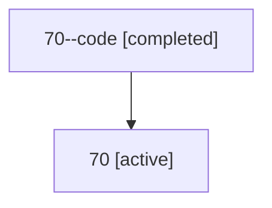

# Family: 70

Owner: `bbugyi200.athena` · Hood: `70` · Members: 2

## Lineage

The diagram is an optional enhancement; the ordered table below contains the same lineage in accessible text.

| Role | Agent | State | Model / provider | Timing | Commits | Prompt | Chat |
|---|---|---|---|---|---:|---|---|
| code | 70--code | completed | gpt-5.6-sol / codex | 2026-07-12T18:45:31.366919+00:00 | 0 | — | [Chat](../agents/bbugyi200.athena.70--code/chat.md) |
| root | 70 | active | claude-fable-5 / claude | 2026-07-12T18:31:05.356016+00:00 | 1 | [Prompt](../agents/bbugyi200.athena.70/prompt.md) | [Chat](../agents/bbugyi200.athena.70/chat.md) |
