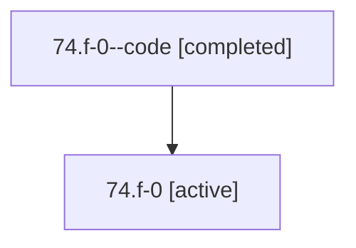

# Family: 74.f-0

Owner: `bbugyi200.athena` · Hood: `74` · Members: 2

## Lineage

The diagram is an optional enhancement; the ordered table below contains the same lineage in accessible text.

| Role | Agent | State | Model / provider | Timing | Commits | Prompt | Chat |
|---|---|---|---|---|---:|---|---|
| code | 74.f-0--code | completed | gpt-5.6-sol / codex | 2026-07-12T20:08:02.723840+00:00 | 0 | — | [Chat](../agents/bbugyi200.athena.74.f-0--code/chat.md) |
| root | 74.f-0 | active | claude-fable-5 / claude | 2026-07-12T19:58:07.701739+00:00 | 1 | [Prompt](../agents/bbugyi200.athena.74.f-0/prompt.md) | [Chat](../agents/bbugyi200.athena.74.f-0/chat.md) |
