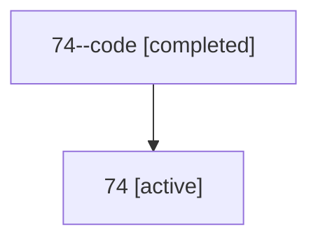

# Family: 74

[Agent Hoods](../README.md) / [bbugyi200](../users/bbugyi200/README.md) / [athena](../users/bbugyi200/machines/athena/README.md) / [74](../users/bbugyi200/machines/athena/hoods/74/README.md) / 74

Owner: `bbugyi200.athena` · Hood: `74` · Members: 2

## Lineage

The diagram is an optional enhancement; the ordered table below contains the same lineage in accessible text.

| Role | Agent | State | Model / provider | Timing | Commits | Prompt | Chat |
|---|---|---|---|---|---:|---|---|
| code | 74--code | completed | gpt-5.6-sol / codex | 2026-07-12T19:41:36.136911+00:00 | [1](../agents/bbugyi200.athena.74--code/README.md#commits) | — | [Chat](../agents/bbugyi200.athena.74--code/chat.md) |
| root | 74 | active | claude-fable-5 / claude | 2026-07-12T19:27:49.410769+00:00 | 0 | [Prompt](../agents/bbugyi200.athena.74/prompt.md) | [Chat](../agents/bbugyi200.athena.74/chat.md) |

## Commits

| Role | Repo | Commit | Subject | Committed |
|---|---|---|---|---|
| code | sase | [`ab0a559`](https://github.com/sase-org/sase/commit/ab0a55920427b845eb14fa674239278dcf04843b) | feat(amd): support customizable agent templates | 2026-07-12 15:57:43 EDT |

## Neighbors

| Agent | Relation | State |
|---|---|---|
| [74.f-0](bbugyi200.athena.74.f-0.md) (family · 2) | descendant | active 1, completed 1 |
