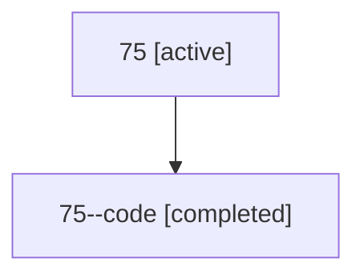

# Family: 75

[Agent Hoods](../README.md) / [bbugyi200](../users/bbugyi200/README.md) / [athena](../users/bbugyi200/machines/athena/README.md) / [75](../users/bbugyi200/machines/athena/hoods/75/README.md) / 75

Owner: `bbugyi200.athena` · Hood: `75` · Members: 2

## Lineage

The diagram is an optional enhancement; the ordered table below contains the same lineage in accessible text.

| Role | Agent | State | Model / provider | Timing | Commits | Prompt | Chat |
|---|---|---|---|---|---:|---|---|
| root | 75 | active | claude-fable-5 / claude | 2026-07-12T20:01:29.504190+00:00 | 0 | [Prompt](../agents/bbugyi200.athena.75/prompt.md) | [Chat](../agents/bbugyi200.athena.75/chat.md) |
| code | 75--code | completed | gpt-5.6-sol / codex | 2026-07-12T20:11:58.402162+00:00 | [1](../agents/bbugyi200.athena.75--code/README.md#commits) | — | [Chat](../agents/bbugyi200.athena.75--code/chat.md) |

## Commits

| Role | Repo | Commit | Subject | Committed |
|---|---|---|---|---|
| code | sase | [`71ee815`](https://github.com/sase-org/sase/commit/71ee8156030e9526c0b788c606fa3401723c3fe3) | fix: exclude internal SDD files from completion attachments | 2026-07-12 16:22:07 EDT |
