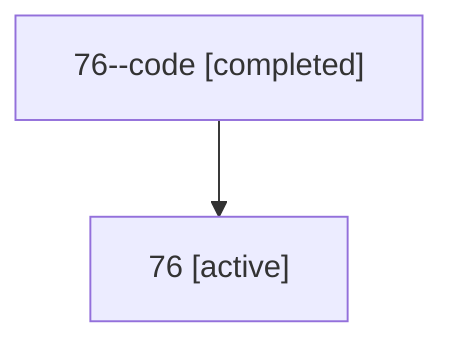

# Family: 76

[Agent Hoods](../README.md) / [bbugyi200](../users/bbugyi200/README.md) / [athena](../users/bbugyi200/machines/athena/README.md) / [76](../users/bbugyi200/machines/athena/hoods/76/README.md) / 76

Owner: `bbugyi200.athena` · Hood: `76` · Members: 2

## Lineage

The diagram is an optional enhancement; the ordered table below contains the same lineage in accessible text.

| Role | Agent | State | Model / provider | Timing | Commits | Prompt | Chat |
|---|---|---|---|---|---:|---|---|
| code | 76--code | completed | gpt-5.6-sol / codex | 2026-07-12T20:22:20.247086+00:00 | [1](../agents/bbugyi200.athena.76--code/README.md#commits) | — | [Chat](../agents/bbugyi200.athena.76--code/chat.md) |
| root | 76 | active | claude-fable-5 / claude | 2026-07-12T20:09:03.964113+00:00 | [1](../agents/bbugyi200.athena.76/README.md#commits) | [Prompt](../agents/bbugyi200.athena.76/prompt.md) | [Chat](../agents/bbugyi200.athena.76/chat.md) |

## Commits

| Role | Repo | Commit | Subject | Committed |
|---|---|---|---|---|
| code | sase | [`4518dc1`](https://github.com/sase-org/sase/commit/4518dc19dd8c68e3f2377630dd35c1e54fc17dcb) | feat: hold failed agent workspaces until dismissal | 2026-07-12 16:43:41 EDT |
| root | sase | [`4518dc1`](https://github.com/sase-org/sase/commit/4518dc19dd8c68e3f2377630dd35c1e54fc17dcb) | feat: hold failed agent workspaces until dismissal | 2026-07-12 16:43:41 EDT |
