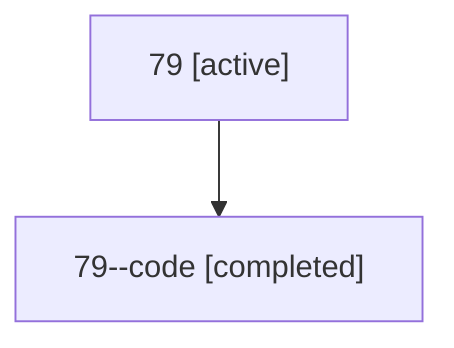

# Family: 79

[Agent Hoods](../README.md) / [bbugyi200](../users/bbugyi200/README.md) / [athena](../users/bbugyi200/machines/athena/README.md) / [79](../users/bbugyi200/machines/athena/hoods/79/README.md) / 79

Owner: `bbugyi200.athena` · Hood: `79` · Members: 2

## Lineage

The diagram is an optional enhancement; the ordered table below contains the same lineage in accessible text.

| Role | Agent | State | Model / provider | Timing | Commits | Prompt | Chat |
|---|---|---|---|---|---:|---|---|
| root | 79 | active | claude-fable-5 / claude | 2026-07-12T20:41:58.587560+00:00 | 0 | [Prompt](../agents/bbugyi200.athena.79/prompt.md) | [Chat](../agents/bbugyi200.athena.79/chat.md) |
| code | 79--code | completed | gpt-5.6-sol / codex | 2026-07-12T21:00:47.274112+00:00 | 0 | — | [Chat](../agents/bbugyi200.athena.79--code/chat.md) |

## Commits

| Role | Repo | Commit | Subject | Committed |
|---|---|---|---|---|
| — | sase | [`38f64ca`](https://github.com/sase-org/sase/commit/38f64ca8e8c48c56e0a719e62e9b3f478aec67eb) | fix(tui): prevent bead warmup pump stalls | 2026-07-12 17:20:56 EDT |
