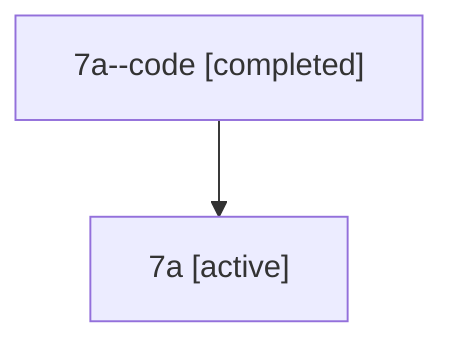

# Family: 7a

Owner: `bbugyi200.athena` · Hood: `7a` · Members: 2

## Lineage

The diagram is an optional enhancement; the ordered table below contains the same lineage in accessible text.

| Role | Agent | State | Model / provider | Timing | Commits | Prompt | Chat |
|---|---|---|---|---|---:|---|---|
| code | 7a--code | completed | gpt-5.6-sol / codex | 2026-07-12T21:11:46.592623+00:00 | 0 | — | [Chat](../agents/bbugyi200.athena.7a--code/chat.md) |
| root | 7a | active | claude-fable-5 / claude | 2026-07-12T20:58:30.131439+00:00 | 1 | [Prompt](../agents/bbugyi200.athena.7a/prompt.md) | [Chat](../agents/bbugyi200.athena.7a/chat.md) |
