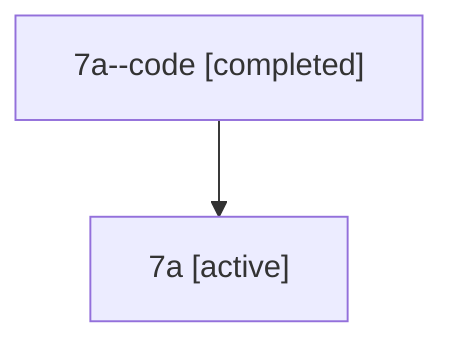

# Family: 7a

[Agent Hoods](../README.md) / [bbugyi200](../users/bbugyi200/README.md) / [athena](../users/bbugyi200/machines/athena/README.md) / [7a](../users/bbugyi200/machines/athena/hoods/7a/README.md) / 7a

Owner: `bbugyi200.athena` · Hood: `7a` · Members: 2

## Lineage

The diagram is an optional enhancement; the ordered table below contains the same lineage in accessible text.

| Role | Agent | State | Model / provider | Timing | Commits | Prompt | Chat |
|---|---|---|---|---|---:|---|---|
| code | 7a--code | completed | gpt-5.6-sol / codex | 2026-07-12T21:11:46.592623+00:00 | 0 | — | [Chat](../agents/bbugyi200.athena.7a--code/chat.md) |
| root | 7a | active | claude-fable-5 / claude | 2026-07-12T20:58:30.131439+00:00 | [1](../agents/bbugyi200.athena.7a/README.md#commits) | [Prompt](../agents/bbugyi200.athena.7a/prompt.md) | [Chat](../agents/bbugyi200.athena.7a/chat.md) |

## Commits

| Role | Repo | Commit | Subject | Committed (UTC) |
|---|---|---|---|---|
| root | sase | [`a66dc39`](https://github.com/sase-org/sase/commit/a66dc398a401c0726b8309a9b3d235fb6a6661d3) | fix: migrate lint integration to toobig | 2026-07-12 21:27:11 |

## Neighbors

| Agent | Relation | State |
|---|---|---|
| [7a.w-0](bbugyi200.athena.7a.w-0.md) (family · 2) | descendant | active 1, completed 1 |
| [7a.w-0.f-0](../agents/bbugyi200.athena.7a.w-0.f-0/README.md) | descendant | active |
