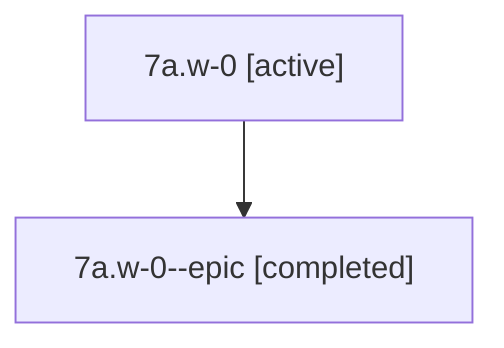

# Family: 7a.w-0

[Agent Hoods](../README.md) / [bbugyi200](../users/bbugyi200/README.md) / [athena](../users/bbugyi200/machines/athena/README.md) / [7a](../users/bbugyi200/machines/athena/hoods/7a/README.md) / 7a.w-0

Owner: `bbugyi200.athena` · Hood: `7a` · Members: 2

## Lineage

The diagram is an optional enhancement; the ordered table below contains the same lineage in accessible text.

| Role | Agent | State | Model / provider | Timing | Commits | Prompt | Chat |
|---|---|---|---|---|---:|---|---|
| root | 7a.w-0 | active | claude-fable-5 / claude | 2026-07-12T21:31:08.921419+00:00 | 0 | [Prompt](../agents/bbugyi200.athena.7a.w-0/prompt.md) | [Chat](../agents/bbugyi200.athena.7a.w-0/chat.md) |
| epic | 7a.w-0--epic | completed | gpt-5.6-sol / codex | 2026-07-12T21:43:03.960288+00:00 | 0 | — | [Chat](../agents/bbugyi200.athena.7a.w-0--epic/chat.md) |

## Neighbors

| Agent | Relation | State |
|---|---|---|
| [7a](bbugyi200.athena.7a.md) (family · 2) | ancestor | active 1, completed 1 |
| [7a.w-0.f-0](../agents/bbugyi200.athena.7a.w-0.f-0/README.md) | descendant | active |
