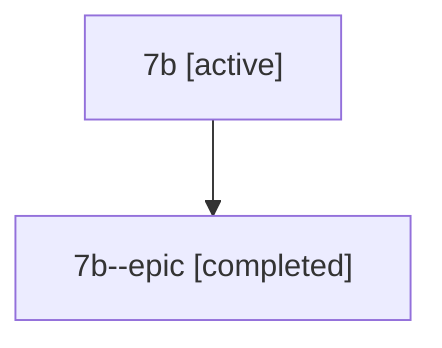

# Family: 7b

Owner: `bbugyi200.athena` · Hood: `7b` · Members: 2

## Lineage

The diagram is an optional enhancement; the ordered table below contains the same lineage in accessible text.

| Role | Agent | State | Model / provider | Timing | Commits | Prompt | Chat |
|---|---|---|---|---|---:|---|---|
| root | 7b | active | claude-fable-5 / claude | 2026-07-12T21:48:02.654618+00:00 | 2 | [Prompt](../agents/bbugyi200.athena.7b/prompt.md) | [Chat](../agents/bbugyi200.athena.7b/chat.md) |
| epic | 7b--epic | completed | gpt-5.6-sol / codex | 2026-07-12T22:12:57.436800+00:00 | 0 | — | [Chat](../agents/bbugyi200.athena.7b--epic/chat.md) |
