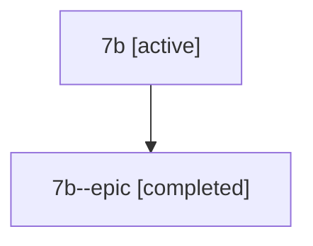

# Family: 7b

[Agent Hoods](../README.md) / [bbugyi200](../users/bbugyi200/README.md) / [athena](../users/bbugyi200/machines/athena/README.md) / [7b](../users/bbugyi200/machines/athena/hoods/7b/README.md) / 7b

Owner: `bbugyi200.athena` · Hood: `7b` · Members: 2

## Lineage

The diagram is an optional enhancement; the ordered table below contains the same lineage in accessible text.

| Role | Agent | State | Model / provider | Timing | Commits | Prompt | Chat |
|---|---|---|---|---|---:|---|---|
| root | 7b | active | claude-fable-5 / claude | 2026-07-12T21:48:02.654618+00:00 | [2](../agents/bbugyi200.athena.7b/README.md#commits) | [Prompt](../agents/bbugyi200.athena.7b/prompt.md) | [Chat](../agents/bbugyi200.athena.7b/chat.md) |
| epic | 7b--epic | completed | gpt-5.6-sol / codex | 2026-07-12T22:12:57.436800+00:00 | 0 | — | [Chat](../agents/bbugyi200.athena.7b--epic/chat.md) |

## Commits

| Role | Commit | Subject | Committed (UTC) |
|---|---|---|---|
| root | [`e87f949`](https://github.com/sase-org/sase/commit/e87f949f68008579a958640411908e17c94d5edd) | chore: Add SDD prompt and plan for agent\_context\_memory\_skills\_panel | 2026-06-14 15:43:53 |
| root | [`9f6e739`](https://github.com/sase-org/sase/commit/9f6e739789a55c3b00e85f6bb07b270cbd11bf62) | feat: audit generated skill usage | 2026-06-14 16:11:45 |

## Neighbors

| Agent | Relation | State |
|---|---|---|
| [7b.f2](../agents/bbugyi200.athena.7b.f2/README.md) | descendant | completed |
| [7b.f3](../agents/bbugyi200.athena.7b.f3/README.md) | descendant | completed |
