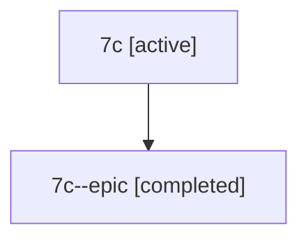

# Family: 7c

[Agent Hoods](../README.md) / [bbugyi200](../users/bbugyi200/README.md) / [athena](../users/bbugyi200/machines/athena/README.md) / [7c](../users/bbugyi200/machines/athena/hoods/7c/README.md) / 7c

Owner: `bbugyi200.athena` · Hood: `7c` · Members: 2

## Lineage

The diagram is an optional enhancement; the ordered table below contains the same lineage in accessible text.

| Role | Agent | State | Model / provider | Timing | Commits | Prompt | Chat |
|---|---|---|---|---|---:|---|---|
| root | 7c | active | claude-fable-5 / claude | 2026-07-12T23:02:27.797250+00:00 | [2](../agents/bbugyi200.athena.7c/README.md#commits) | [Prompt](../agents/bbugyi200.athena.7c/prompt.md) | [Chat](../agents/bbugyi200.athena.7c/chat.md) |
| epic | 7c--epic | completed | gpt-5.6-sol / codex | 2026-07-12T23:19:55.562838+00:00 | 0 | — | [Chat](../agents/bbugyi200.athena.7c--epic/chat.md) |

## Commits

| Role | Repo | Commit | Subject | Committed (UTC) |
|---|---|---|---|---|
| root | sase | [`c717162`](https://github.com/sase-org/sase/commit/c7171621956131316efa9836c752cd0f94f10de2) | chore: Add SDD prompt and plan for bulk\_agent\_revert | 2026-06-14 15:46:42 |
| root | sase | [`7babf67`](https://github.com/sase-org/sase/commit/7babf670a8caab72e9d4ae928f20c8084fbc3c71) | feat(ace): bulk-revert all marked agents with leader \`,r\` | 2026-06-14 16:04:53 |
