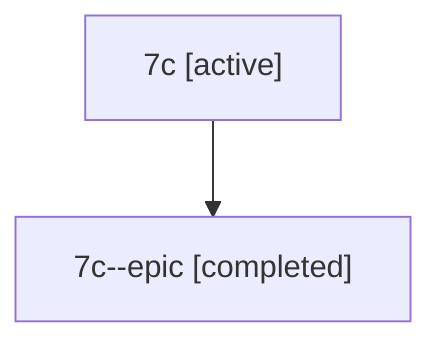

# Family: 7c

Owner: `bbugyi200.athena` · Hood: `7c` · Members: 2

## Lineage

The diagram is an optional enhancement; the ordered table below contains the same lineage in accessible text.

| Role | Agent | State | Model / provider | Timing | Commits | Prompt | Chat |
|---|---|---|---|---|---:|---|---|
| root | 7c | active | claude-fable-5 / claude | 2026-07-12T23:02:27.797250+00:00 | 2 | [Prompt](../agents/bbugyi200.athena.7c/prompt.md) | [Chat](../agents/bbugyi200.athena.7c/chat.md) |
| epic | 7c--epic | completed | gpt-5.6-sol / codex | 2026-07-12T23:19:55.562838+00:00 | 0 | — | [Chat](../agents/bbugyi200.athena.7c--epic/chat.md) |
