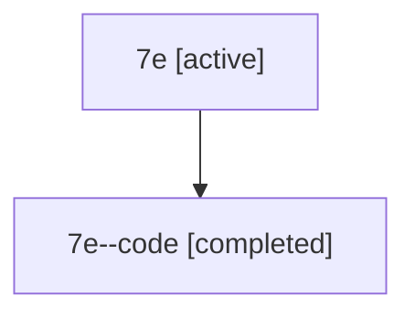

# Family: 7e

Owner: `bbugyi200.athena` · Hood: `7e` · Members: 2

## Lineage

The diagram is an optional enhancement; the ordered table below contains the same lineage in accessible text.

| Role | Agent | State | Model / provider | Timing | Commits | Prompt | Chat |
|---|---|---|---|---|---:|---|---|
| root | 7e | active | gpt-5.6-sol / codex | 2026-07-13T10:43:40.326689+00:00 | 1 | [Prompt](../agents/bbugyi200.athena.7e/prompt.md) | [Chat](../agents/bbugyi200.athena.7e/chat.md) |
| code | 7e--code | completed | gpt-5.6-sol / codex | 2026-07-13T10:52:09.358376+00:00 | 1 | — | [Chat](../agents/bbugyi200.athena.7e--code/chat.md) |
