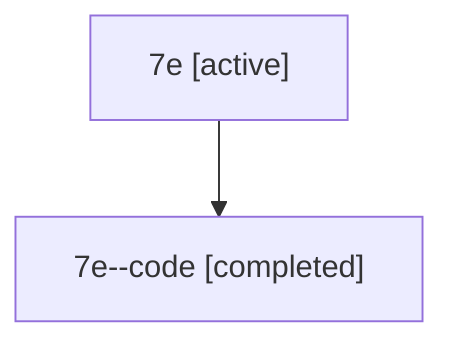

# Family: 7e

[Agent Hoods](../README.md) / [bbugyi200](../users/bbugyi200/README.md) / [athena](../users/bbugyi200/machines/athena/README.md) / [7e](../users/bbugyi200/machines/athena/hoods/7e/README.md) / 7e

Owner: `bbugyi200.athena` · Hood: `7e` · Members: 2

## Lineage

The diagram is an optional enhancement; the ordered table below contains the same lineage in accessible text.

| Role | Agent | State | Model / provider | Timing | Commits | Prompt | Chat |
|---|---|---|---|---|---:|---|---|
| root | 7e | active | gpt-5.6-sol / codex | 2026-07-13T10:43:40.326689+00:00 | [1](../agents/bbugyi200.athena.7e/README.md#commits) | [Prompt](../agents/bbugyi200.athena.7e/prompt.md) | [Chat](../agents/bbugyi200.athena.7e/chat.md) |
| code | 7e--code | completed | gpt-5.6-sol / codex | 2026-07-13T10:52:09.358376+00:00 | 0 | — | [Chat](../agents/bbugyi200.athena.7e--code/chat.md) |

## Commits

| Role | Repo | Commit | Subject | Committed |
|---|---|---|---|---|
| root | sase | [`3d5fe9c`](https://github.com/sase-org/sase/commit/3d5fe9c50a8e3d68f04bf1a5a033247e65f79c0a) | fix: complete Symvision migration recovery (sase-5t.5) | 2026-07-13 07:04:43 EDT |
