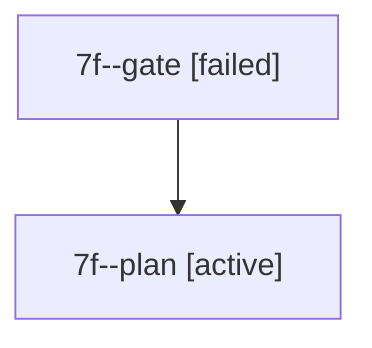

# Family: 7f

[Agent Hoods](../README.md) / [bbugyi200](../users/bbugyi200/README.md) / [athena](../users/bbugyi200/machines/athena/README.md) / [7f](../users/bbugyi200/machines/athena/hoods/7f/README.md) / 7f

Owner: `bbugyi200.athena` · Hood: `7f` · Members: 2

## Lineage

The diagram is an optional enhancement; the ordered table below contains the same lineage in accessible text.

| Role | Agent | State | Model / provider | Timing | Commits | Prompt | Chat |
|---|---|---|---|---|---:|---|---|
| gate | 7f--gate | failed | claude-fable-5 / claude | 2026-09-13T21:11:46.239539+00:00 → 2026-09-13T21:28:54.280005+00:00 | 0 | — | [Chat](../agents/bbugyi200.athena.7f--gate/chat.md) |
| plan | 7f--plan | active | claude-fable-5 / claude | 2026-09-13T21:00:39.175470+00:00 | 0 | [Prompt](../agents/bbugyi200.athena.7f--plan/prompt.md) | [Chat](../agents/bbugyi200.athena.7f--plan/chat.md) |

## Commits

| Role | Repo | Commit | Subject | Committed |
|---|---|---|---|---|
| — | sase | [`f8ce046`](https://github.com/sase-org/sase/commit/f8ce04634a5a63dab59945ddb00bdeaaf4770feb) | chore: Add SDD prompt and plan for agent\_family\_context\_1 | 2026-06-14 13:11:04 EDT |
| — | sase | [`64bd2fb`](https://github.com/sase-org/sase/commit/64bd2fbd66cc46b96a769af0e5a25fd319b7d724) | feat(ace): attribute agent-family context in metadata panel | 2026-06-14 13:35:54 EDT |

## Neighbors

| Agent | Relation | State |
|---|---|---|
| [7f.w1](../agents/bbugyi200.athena.7f.w1/README.md) | descendant | completed |
