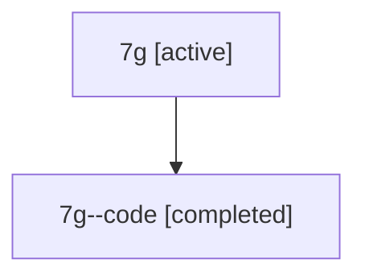

# Family: 7g

Owner: `bbugyi200.athena` · Hood: `7g` · Members: 2

## Lineage

The diagram is an optional enhancement; the ordered table below contains the same lineage in accessible text.

| Role | Agent | State | Model / provider | Timing | Commits | Prompt | Chat |
|---|---|---|---|---|---:|---|---|
| root | 7g | active | claude-fable-5 / claude | 2026-07-13T10:49:10.327586+00:00 | 3 | [Prompt](../agents/bbugyi200.athena.7g/prompt.md) | [Chat](../agents/bbugyi200.athena.7g/chat.md) |
| code | 7g--code | completed | gpt-5.6-sol / codex | 2026-07-13T11:03:07.990449+00:00 | 1 | — | [Chat](../agents/bbugyi200.athena.7g--code/chat.md) |
