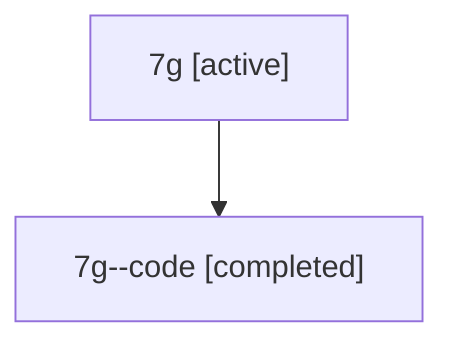

# Family: 7g

[Agent Hoods](../README.md) / [bbugyi200](../users/bbugyi200/README.md) / [athena](../users/bbugyi200/machines/athena/README.md) / [7g](../users/bbugyi200/machines/athena/hoods/7g/README.md) / 7g

Owner: `bbugyi200.athena` · Hood: `7g` · Members: 2

## Lineage

The diagram is an optional enhancement; the ordered table below contains the same lineage in accessible text.

| Role | Agent | State | Model / provider | Timing | Commits | Prompt | Chat |
|---|---|---|---|---|---:|---|---|
| root | 7g | active | claude-fable-5 / claude | 2026-07-13T10:49:10.327586+00:00 | [3](../agents/bbugyi200.athena.7g/README.md#commits) | [Prompt](../agents/bbugyi200.athena.7g/prompt.md) | [Chat](../agents/bbugyi200.athena.7g/chat.md) |
| code | 7g--code | completed | gpt-5.6-sol / codex | 2026-07-13T11:03:07.990449+00:00 | [1](../agents/bbugyi200.athena.7g--code/README.md#commits) | — | [Chat](../agents/bbugyi200.athena.7g--code/chat.md) |

## Commits

| Role | Commit | Subject | Committed (UTC) |
|---|---|---|---|
| root | [`b48c65f`](https://github.com/sase-org/sase/commit/b48c65f33e624ca9c3e3b28811ffccaff92a68d9) | chore: Add SDD prompt and plan for temp\_revert\_agent\_keymap\_fixture\_1 | 2026-06-14 17:12:17 |
| root | [`806f487`](https://github.com/sase-org/sase/commit/806f487e2498d8b562ac8aadd87097cddc5c80e5) | docs(research): add temporary revert-agent keymap fixture marker | 2026-06-14 17:13:40 |
| code | [`836d738`](https://github.com/sase-org/sase/commit/836d73818b0218403744da2ff32d3133679bf2fc) | fix: release failed workspaces without visible notifications | 2026-07-13 11:13:16 |
| root | [`836d738`](https://github.com/sase-org/sase/commit/836d73818b0218403744da2ff32d3133679bf2fc) | fix: release failed workspaces without visible notifications | 2026-07-13 11:13:16 |
