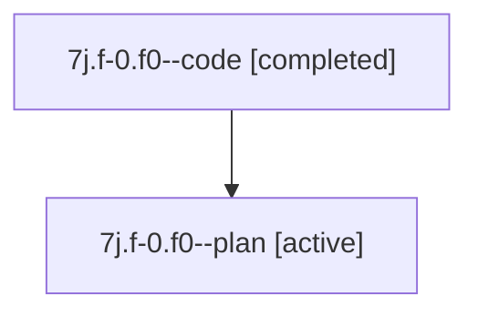

# Family: 7j.f-0.f0

[Agent Hoods](../README.md) / [bbugyi200](../users/bbugyi200/README.md) / [athena](../users/bbugyi200/machines/athena/README.md) / [7j](../users/bbugyi200/machines/athena/hoods/7j/README.md) / 7j.f-0.f0

Owner: `bbugyi200.athena` · Hood: `7j` · Members: 2

## Lineage

The diagram is an optional enhancement; the ordered table below contains the same lineage in accessible text.

| Role | Agent | State | Model / provider | Timing | Commits | Prompt | Chat |
|---|---|---|---|---|---:|---|---|
| code | 7j.f-0.f0--code | completed | gpt-5.6-sol / codex | 2026-07-13T12:59:08.257028+00:00 | 0 | — | [Chat](../agents/bbugyi200.athena.7j.f-0.f0--code/chat.md) |
| plan | 7j.f-0.f0--plan | active | gpt-5.6-sol / codex | 2026-07-13T08:56:02.206463 | 0 | [Prompt](../agents/bbugyi200.athena.7j.f-0.f0--plan/prompt.md) | [Chat](../agents/bbugyi200.athena.7j.f-0.f0--plan/chat.md) |

## Neighbors

| Agent | Relation | State |
|---|---|---|
| [7j.f-0](bbugyi200.athena.7j.f-0.md) (family · 2) | ancestor | active 1, completed 1 |
| [7j](bbugyi200.athena.7j.md) (family · 2) | ancestor | active 1, completed 1 |
