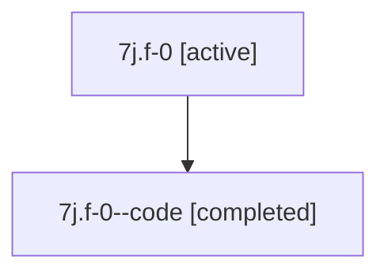

# Family: 7j.f-0

[Agent Hoods](../README.md) / [bbugyi200](../users/bbugyi200/README.md) / [athena](../users/bbugyi200/machines/athena/README.md) / [7j](../users/bbugyi200/machines/athena/hoods/7j/README.md) / 7j.f-0

Owner: `bbugyi200.athena` · Hood: `7j` · Members: 2

## Lineage

The diagram is an optional enhancement; the ordered table below contains the same lineage in accessible text.

| Role | Agent | State | Model / provider | Timing | Commits | Prompt | Chat |
|---|---|---|---|---|---:|---|---|
| root | 7j.f-0 | active | gpt-5.6-sol / codex | 2026-07-13T11:35:22.341034+00:00 | [1](../agents/bbugyi200.athena.7j.f-0/README.md#commits) | [Prompt](../agents/bbugyi200.athena.7j.f-0/prompt.md) | [Chat](../agents/bbugyi200.athena.7j.f-0/chat.md) |
| code | 7j.f-0--code | completed | gpt-5.6-sol / codex | 2026-07-13T11:42:15.284985+00:00 | 0 | — | [Chat](../agents/bbugyi200.athena.7j.f-0--code/chat.md) |

## Commits

| Role | Commit | Subject | Committed (UTC) |
|---|---|---|---|
| root | [`e635b1f`](https://github.com/sase-org/sase/commit/e635b1f2a8bee7d44a3ceb50392cb19125c9454e) | fix: drain runners before detached workflow launches | 2026-07-13 11:55:16 |

## Neighbors

| Agent | Relation | State |
|---|---|---|
| [7j](bbugyi200.athena.7j.md) (family · 2) | ancestor | active 1, completed 1 |
| [7j.f-0.f0](bbugyi200.athena.7j.f-0.f0.md) (family · 2) | descendant | active 1, completed 1 |
| [7j.f-0.f0](../agents/bbugyi200.athena.7j.f-0.f0/README.md) | descendant | completed |
