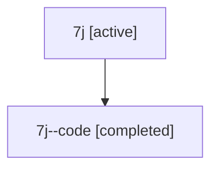

# Family: 7j

[Agent Hoods](../README.md) / [bbugyi200](../users/bbugyi200/README.md) / [athena](../users/bbugyi200/machines/athena/README.md) / [7j](../users/bbugyi200/machines/athena/hoods/7j/README.md) / 7j

Owner: `bbugyi200.athena` · Hood: `7j` · Members: 2

## Lineage

The diagram is an optional enhancement; the ordered table below contains the same lineage in accessible text.

| Role | Agent | State | Model / provider | Timing | Commits | Prompt | Chat |
|---|---|---|---|---|---:|---|---|
| root | 7j | active | gpt-5.6-sol / codex | 2026-07-13T11:13:38.923944+00:00 | [3](../agents/bbugyi200.athena.7j/README.md#commits) | [Prompt](../agents/bbugyi200.athena.7j/prompt.md) | [Chat](../agents/bbugyi200.athena.7j/chat.md) |
| code | 7j--code | completed | gpt-5.6-sol / codex | 2026-07-13T11:17:54.516780+00:00 | 0 | — | [Chat](../agents/bbugyi200.athena.7j--code/chat.md) |

## Commits

| Role | Repo | Commit | Subject | Committed |
|---|---|---|---|---|
| root | sase | [`b0caeff`](https://github.com/sase-org/sase/commit/b0caefff752ad639130bd7c8823865aeaaa3795b) | chore: Add SDD prompt and plan for remove\_plan\_directive\_1 | 2026-06-14 17:06:56 EDT |
| root | sase | [`58b44e2`](https://github.com/sase-org/sase/commit/58b44e2d84882dae5729707e6c8b11076b08b581) | feat!: remove legacy %plan/%p xprompt directive | 2026-06-14 17:24:19 EDT |
| root | sase | [`a086bb9`](https://github.com/sase-org/sase/commit/a086bb95274059d4a46b35b1161792f974e51aa9) | feat!: rename pylimit\_split workflow to toobig\_split | 2026-07-13 07:30:45 EDT |

## Neighbors

| Agent | Relation | State |
|---|---|---|
| [7j.f-0](bbugyi200.athena.7j.f-0.md) (family · 2) | descendant | active 1, completed 1 |
| [7j.f-0.f0](bbugyi200.athena.7j.f-0.f0.md) (family · 2) | descendant | active 1, completed 1 |
| [7j.f-0.f0](../agents/bbugyi200.athena.7j.f-0.f0/README.md) | descendant | completed |
