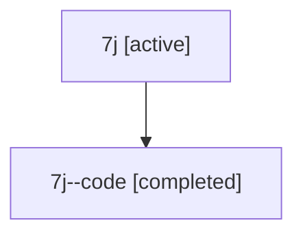

# Family: 7j

Owner: `bbugyi200.athena` · Hood: `7j` · Members: 2

## Lineage

The diagram is an optional enhancement; the ordered table below contains the same lineage in accessible text.

| Role | Agent | State | Model / provider | Timing | Commits | Prompt | Chat |
|---|---|---|---|---|---:|---|---|
| root | 7j | active | gpt-5.6-sol / codex | 2026-07-13T11:13:38.923944+00:00 | 3 | [Prompt](../agents/bbugyi200.athena.7j/prompt.md) | [Chat](../agents/bbugyi200.athena.7j/chat.md) |
| code | 7j--code | completed | gpt-5.6-sol / codex | 2026-07-13T11:17:54.516780+00:00 | 0 | — | [Chat](../agents/bbugyi200.athena.7j--code/chat.md) |
