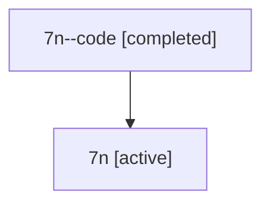

# Family: 7n

[Agent Hoods](../README.md) / [bbugyi200](../users/bbugyi200/README.md) / [athena](../users/bbugyi200/machines/athena/README.md) / [7n](../users/bbugyi200/machines/athena/hoods/7n/README.md) / 7n

Owner: `bbugyi200.athena` · Hood: `7n` · Members: 2

## Lineage

The diagram is an optional enhancement; the ordered table below contains the same lineage in accessible text.

| Role | Agent | State | Model / provider | Timing | Commits | Prompt | Chat |
|---|---|---|---|---|---:|---|---|
| code | 7n--code | completed | gpt-5.6-sol / codex | 2026-07-13T11:44:17.567458+00:00 | [1](../agents/bbugyi200.athena.7n--code/README.md#commits) | — | [Chat](../agents/bbugyi200.athena.7n--code/chat.md) |
| root | 7n | active | claude-fable-5 / claude | 2026-07-13T11:32:40.110812+00:00 | [3](../agents/bbugyi200.athena.7n/README.md#commits) | [Prompt](../agents/bbugyi200.athena.7n/prompt.md) | [Chat](../agents/bbugyi200.athena.7n/chat.md) |

## Commits

| Role | Commit | Subject | Committed (UTC) |
|---|---|---|---|
| root | [`71207d0`](https://github.com/sase-org/sase/commit/71207d0cacde38b4c9bb214197592bbe69d66a46) | chore: Add SDD prompt and plan for macbook\_screenshots\_1 | 2026-06-14 23:23:54 |
| root | [`48143c9`](https://github.com/sase-org/sase/commit/48143c91634cfdea42839f6354cd4c9cc3b39fe6) | chore: Mark SDD plan done | 2026-06-14 23:29:53 |
| code | [`bfb468c`](https://github.com/sase-org/sase/commit/bfb468ca853939662e7ed9fc2fd5ce1c558ebc1b) | fix: auto-commit Q&A prompt snapshots | 2026-07-13 12:00:16 |
| root | [`bfb468c`](https://github.com/sase-org/sase/commit/bfb468ca853939662e7ed9fc2fd5ce1c558ebc1b) | fix: auto-commit Q&A prompt snapshots | 2026-07-13 12:00:16 |
